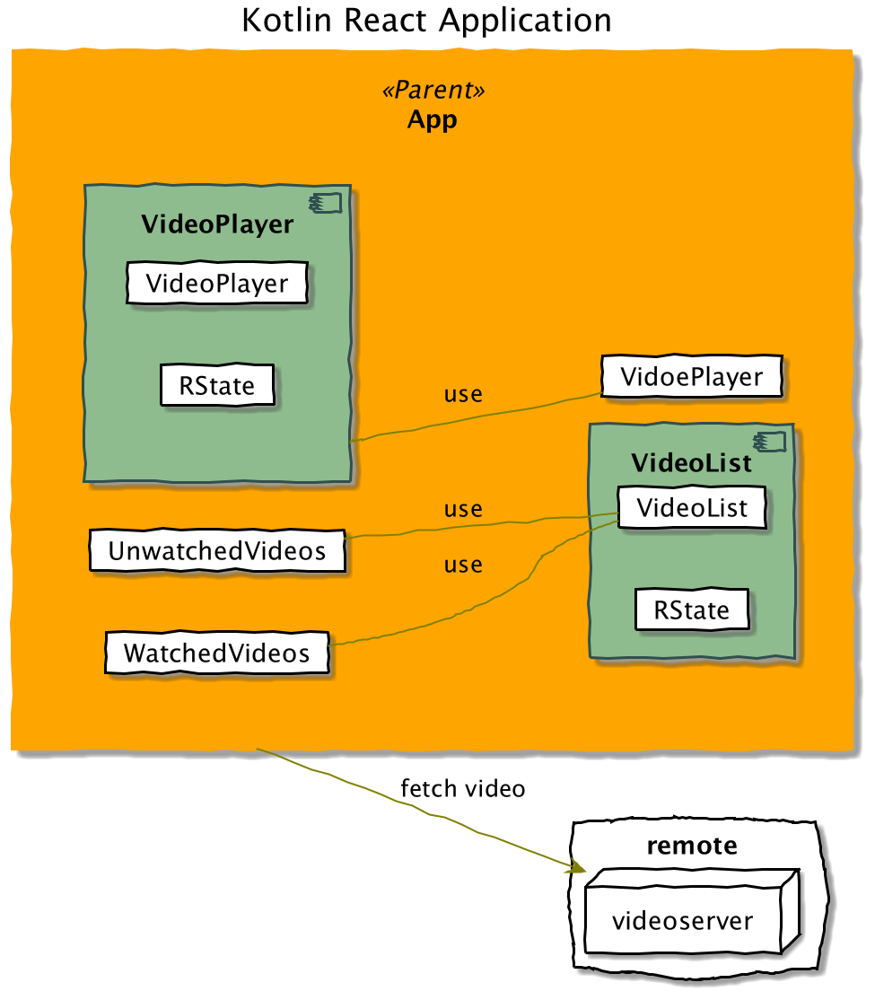

# Sample kotlin react
Kotlin React in Action

# State Lifting

# Component

`Component to list the video`

```kotlin
class VideoPlayer: RComponent<VideoPlayerProps,RState>(){
  
}
```

`Component to Play the video`

```kotlin
class VideoPlayer: RComponent<VideoPlayerProps,RState>(){
  
}
```
`main component`

```kotlin
class App : RComponent<RProps, AppState>() {

}
```



## Properties
## State

